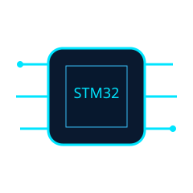

<div align="center">


# Hey there, I'm Dharshini 👋


<p align="center">


</p>

</div>


## About Me

<table>
<tr>
<td width="65%" valign="top">

### Embedded • Firmware • Industrial IoT

- ⚡ STM32 & ESP32 Firmware
- 🧠 Zephyr RTOS & Linux
- 📡 MQTT & Modbus RTU
- 🌐 Industrial IoT
- 🚀 Edge Computing

**Projects**

- Energy Monitoring (ESP32 + RS485 + Modbus + MQTT)
- VEGA IoT Platform (Renesas RA6E2)
- Smart Classroom Automation
- LoRa + Bluetooth Communication
- Li‑Fi V2V Prototype
- Smart Irrigation

</td>
<td width="35%" align="center">

</td>
</tr>
</table>


## Tech Stack

<div align="center">


</div>


## Engineering Dashboard

| Module | Status |
|--------|--------|
| Firmware | 🟢 Online |
| RTOS | 🟢 Running |
| MQTT | 🟢 Active |
| Linux | 🟢 Ready |

```bash
$ whoami
Dharshini I

$ current_focus
→ Embedded Firmware
→ Industrial IoT
→ Zephyr RTOS
→ Linux Drivers
```


## GitHub Analytics

<div align="center">


</div>


## Contribution Snake

<div align="center">


</div>

> Generated automatically with the GitHub Action in `.github/workflows/snake.yml`.


## Connect

<div align="center">

<a href="https://www.linkedin.com/in/dharshini-i-424364333/"></a>

<a href="https://leetcode.com/u/idharshini/"></a>

<a href="mailto:your_email@example.com"></a>

</div>


