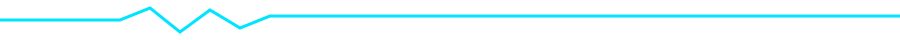

<!-- ============ HERO ============ -->
<table>
<tr>
<td width="50%" valign="top">

 

# Dharshini

**Building intelligent embedded systems that bridge hardware and software.**

 

  

  

</td>
<td width="50%" valign="top" align="center">

 

</td>
</tr>
</table>

 

<!-- ============ ABOUT ME ============ -->
## About Me

<table>
<tr>
<td width="60%" valign="top">

I'm an Electrical & Electronics Engineering student who spends more time in datasheets than lecture notes. I build the layer where hardware and software actually have to agree with each other — firmware that talks to sensors, protocols that move data reliably, and systems that don't fall over in the field.

- 🔧 Currently deepening low-level control on **STM32** via register-level programming
- 📡 Comfortable across **MQTT, Modbus RTU, RS-485,** and **LoRa** for industrial links
- 🧠 Exploring **RISC-V** architecture and **Zephyr RTOS** for next builds
- 🎯 Aiming for a career in **Embedded / Firmware Engineering**, IIoT-focused

</td>
<td width="40%" align="center">

</td>
</tr>
</table>

<!-- ============ TECH STACK ============ -->
## Tech Stack

<table>
<tr>
<td width="50%" valign="top">

### Languages

</td>
<td width="50%" valign="top">

### Embedded Platforms

</td>
</tr>
<tr>
<td width="50%" valign="top">

### Industrial Communication

</td>
<td width="50%" valign="top">

### Tools

</td>
</tr>
</table>

<!-- ============ FEATURED PROJECTS ============ -->
## Featured Projects

<table>
<tr>
<td width="50%" valign="top">

<h3>⚡ Classroom Power Automation</h3>

Smart classroom control system that automates power based on occupancy and schedule.

</td>
<td width="50%" valign="top">

<h3>📊 Industrial Energy Monitoring</h3>

Real-time energy monitoring using EM6400 meters over an industrial serial link.

</td>
</tr>
<tr>
<td width="50%" valign="top">

<h3>📶 LoRa Communication Prototype</h3>

Long-range wireless communication prototype for low-power sensor networks.

</td>
<td width="50%" valign="top">

<h3>🎥 AI CCTV Natural Language Search</h3>

Computer vision-powered intelligent video retrieval using natural language queries.

</td>
</tr>
</table>

<!-- ============ CURRENTLY LEARNING ============ -->
## Currently Learning

<table width="100%">
<tr><td>

**STM32 Register Programming**  `████████░░`  80%

**RISC-V**  `██████░░░░`  60%

**Zephyr RTOS**  `█████░░░░░`  50%

**Embedded Linux**  `████░░░░░░`  40%

**Computer Vision**  `███░░░░░░░`  30%

</td></tr>
</table>

<!-- ============ GITHUB ANALYTICS ============ -->
## GitHub Analytics

 

### Activity Graph

### Contribution Snake

<picture>
  <source media="(prefers-color-scheme: dark)" srcset="https://raw.githubusercontent.com/YOUR_USERNAME/YOUR_USERNAME/output/dist/snake-dark.svg">
  <source media="(prefers-color-scheme: light)" srcset="https://raw.githubusercontent.com/YOUR_USERNAME/YOUR_USERNAME/output/dist/snake-light.svg">
  
</picture>

<!-- ============ ACHIEVEMENTS TIMELINE ============ -->
## Achievements Timeline

<table width="100%">
<tr>
<td align="center" width="25%">

🏆 <b>Hackzilla</b> Participant <code>YEAR</code>

</td>
<td align="center" width="25%">

🚀 <b>AzinHack</b> Participant <code>YEAR</code>

</td>
<td align="center" width="25%">

📜 <b>ETALVIS</b> C Programming Certificate <code>YEAR</code>

</td>
<td align="center" width="25%">

🎓 <b>NPTEL</b> Learner <code>YEAR</code>

</td>
</tr>
</table>

<!-- ============ CONNECT ============ -->
## Connect With Me

<!-- ============ FOOTER ============ -->

### Currently Building

`STM32 Drivers` · `Zephyr RTOS` · `Industrial IoT` · `Embedded Linux`

 

 

<i>Code is my toolkit. Hardware is my playground. Together, they create real-world impact.</i>

  

YOUR_COLLEGE_NAME · Electrical & Electronics Engineering

