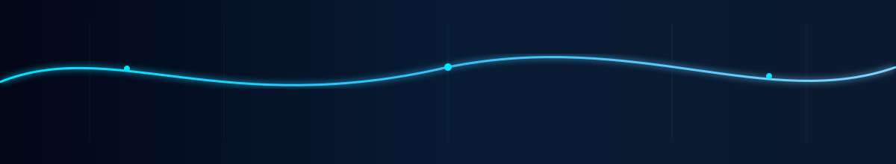

# Hey there, I'm Dharshini 👋

Code is my toolkit. Hardware is my playground.

  

## About Me

<table>
<tr>
<td width="65%" valign="top">

I'm an **Electrical & Electronics Engineering** student passionate about Embedded Systems and Industrial IoT — I like building things that sit right at the boundary of hardware and code.

**Currently Working On**

- STM32 register-level programming
- ESP32 + MQTT + Modbus RTU
- Zephyr RTOS
- Linux & embedded development
- Portfolio-grade firmware projects

</td>
<td width="35%" align="center">

**Tech DNA**

 

 

</td>
</tr>
</table>

## Tech Stack

<table align="center">
<tr>
<td width="25%" align="center" valign="top">

**Languages**

</td>
<td width="25%" align="center" valign="top">

**Embedded**

 
 

</td>
<td width="25%" align="center" valign="top">

**Protocols**

 
 

</td>
<td width="25%" align="center" valign="top">

**Tools**

</td>
</tr>
</table>

## Featured Projects

<table>
<tr>
<td width="50%" valign="top">

**⚡ Energy Monitoring**

ESP32-based industrial power monitoring over RS485, polled via Modbus RTU and streamed through MQTT.

</td>
<td width="50%" valign="top">

**🔗 VEGA IoT Platform**

An IoT platform built on the Renesas RA6E2, designed for reliable, low-power industrial data collection.

</td>
</tr>
<tr>
<td width="50%" valign="top">

**🏫 Smart Classroom Automation**

Occupancy-aware automation for classroom power and lighting, controlled remotely over MQTT.

</td>
<td width="50%" valign="top">

**📡 LoRa + Bluetooth Communication**

Dual-link prototype combining LoRa for range and Bluetooth for short-range, low-latency handoff.

</td>
</tr>
<tr>
<td width="50%" valign="top">

**💡 Li-Fi V2V Prototype**

Vehicle-to-vehicle communication prototype using visible light instead of RF for short-range data exchange.

</td>
<td width="50%" valign="top">

**🌱 Smart Irrigation**

Sensor-driven irrigation system that automates watering based on real-time soil and environmental data.

</td>
</tr>
</table>

## GitHub Analytics

## Contribution Snake

<picture>
  <source media="(prefers-color-scheme: dark)" srcset="https://raw.githubusercontent.com/idharshini/idharshini/output/github-contribution-grid-snake-dark.svg">
  <source media="(prefers-color-scheme: light)" srcset="https://raw.githubusercontent.com/idharshini/idharshini/output/github-contribution-grid-snake.svg">
  
</picture>

## Connect

  

Currently building: firmware that's a little more reliable than yesterday's.

